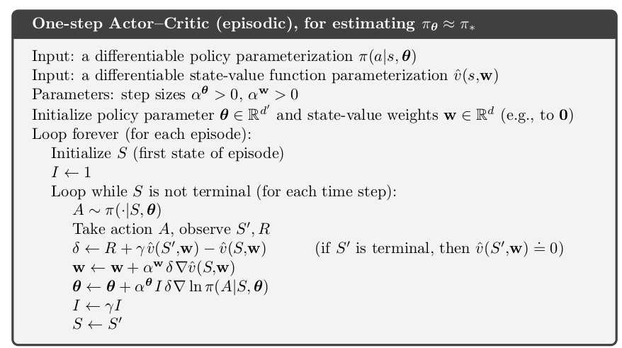

# This folder contains one code file until now: 
## actor-critic.py

## Code general explanation:

This code implements the following algoritm:

This algorithm was taken from the book "Reinforcement Learning An Introduction, second edition by Richard S. Sutton and Andrew G. Barto"

The code is divided into two sections. The agent class declaration and agent training.

You can modify the following agent parameters:

**Agent instantiation**

actor neural network parameters:

 - number of layers
 - number of neurons on each layer
 - type of decay for the learning rate
 - the activation function for the layers
 - mean and standard deviation for the normal distribution weights initialization
 
critic neural network parameters:

 - number of layers
 - number of neurons on each layer
 - type of decay for the learning rate
 - the activation function for the layers
 - mean and standard deviation for the normal distribution weights initialization

**Training**

 - number of episodes
 - the number of samples to consider before updating the agent weights.
 - batch size

### TODO

 - Ability to work under continuous actions
 - the option of natural gradients

## EXAMPLE

Set the following parameters as you may see fit. Then run the code. The code will save the model parameters and show you two training plots. 

    #------------loops parameters------------------------------
    num_mem = 300 #amount of samples collected before training
    ratio = 30   #we devide the shuffle memories in ratio number of sets whose size is "mini_batch_size"
    mini_batch_size = num_mem/ratio ##mini_batch_size = num_mem / ratio must be integer
    mini_batch_size = int(mini_batch_size)
    #----------------------------------------------------------
    
    #-------------plot arrays initialization-------------------
    num_episodes = 15000 # episodes
    plotlist = list(np.zeros(num_episodes)) #plot array
    plot_list_avg = list(np.zeros(int(num_episodes/100.0)))
    #----------------------------------------------------------

    #-------------Agent instantiation -------------------------
    tf.reset_default_graph()
    agent= agent_episodic_continuous_action(gamma=1,s_size=4,a_size=2,action_type="discrete",amount_of_data_to_memorize=num_mem,optimizer="GRAD")

    agent.create_actor_brain(hidd_layer=[8],hidd_act_fn="relu",output_act_fn="linear",mean=0.0,stddev=0.14)
    agent.create_critic_brain(hidd_layer=[8],hidd_act_fn="relu",output_act_fn="linear",mean=0.0,stddev=0.14)
    agent.set_actor_learning_rate_decay(optimizer="GRAD",type_of_decay="exponential",learning_rate = 0.001/1,decay_steps = 5000, decay_rate = 0.1)
    agent.set_critic_learning_rate_decay(optimizer="GRAD",type_of_decay="exponential",learning_rate = 0.001/1,decay_steps = 5000, decay_rate = 0.1)

    agent.create_new_graph_connections()
    #----------------------------------------------------------
    #-------------Save model ----------------------------------
    are_we_saving = False
    path_to_save = "some/path/to/somewhere"
    #----------------------------------------------------------

 
