# We explain line by line awJuliani's vanilla policy gradient algorithm for the cart-pole open AI environment.

```python
import tensorflow as tf
import tensorflow.contrib.slim as slim
import numpy as np
import gym
import matplotlib.pyplot as plt
%matplotlib inline

try:
    xrange = xrange
except:
    xrange = range
``` 

## The purpose of the section above is to import the required libraries. Also, it makes xrange compatible with both, Python 2 and 3 by checking whether xrange or range is available.


```python
env = gym.make('CartPole-v0')
 ```    
 
## This line selects the cart-pole environment from the gym library
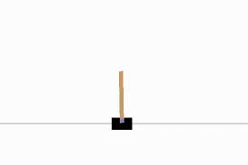
```python
gamma = 0.99

def discount_rewards(r):
    """ take 1D float array of rewards and compute discounted reward """
    discounted_r = np.zeros_like(r)
    running_add = 0
    for t in reversed(xrange(0, r.size)):
        running_add = running_add * gamma + r[t]
        discounted_r[t] = running_add
    return discounted_r
``` 
     
## This function calculates the discounted rewards of the steps. We can see an explanation in the figure below:

### Assuming gamma = 0.99


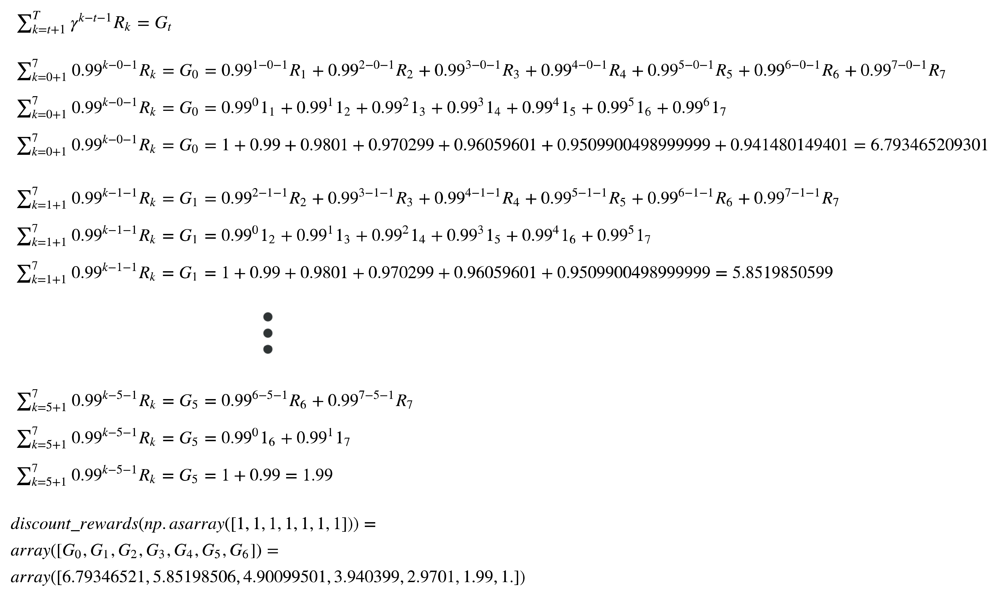     
     
```python     
 class agent():
    def __init__(self, lr, s_size,a_size,h_size):
        #These lines established the feed-forward part of the network. The agent takes a state and produces an action.
        self.state_in= tf.placeholder(shape=[None,s_size],dtype=tf.float32)
        hidden = slim.fully_connected(self.state_in,h_size,biases_initializer=None,activation_fn=tf.nn.relu)
        self.output = slim.fully_connected(hidden,a_size,activation_fn=tf.nn.softmax,biases_initializer=None)
        self.chosen_action = tf.argmax(self.output,1)

        #The next six lines establish the training proceedure. We feed the reward and chosen action into the network
        #to compute the loss, and use it to update the network.
        self.reward_holder = tf.placeholder(shape=[None],dtype=tf.float32)
        self.action_holder = tf.placeholder(shape=[None],dtype=tf.int32)
        
        self.indexes = tf.range(0, tf.shape(self.output)[0]) * tf.shape(self.output)[1] + self.action_holder
        self.responsible_outputs = tf.gather(tf.reshape(self.output, [-1]), self.indexes)

        self.loss = -tf.reduce_mean(tf.log(self.responsible_outputs)*self.reward_holder)
        
        tvars = tf.trainable_variables()
        self.gradient_holders = []
        for idx,var in enumerate(tvars):
            placeholder = tf.placeholder(tf.float32,name=str(idx)+'_holder')
            self.gradient_holders.append(placeholder)
        
        self.gradients = tf.gradients(self.loss,tvars)
        
        optimizer = tf.train.AdamOptimizer(learning_rate=lr)
        self.update_batch = optimizer.apply_gradients(zip(self.gradient_holders,tvars))    
```

# Now we explain the Agent class line by line:

    class agent():

### The line above is used to define a class in python.

    def __init__(self, lr, s_size, a_size, h_size):
    
### This line is the constructor of the class. The constructor expects to receive four parameters, besides self, whenever we instantiate an agent object. These parameters are the following:

* **self**: It is always passed as an argument to the constructor you dont need to give it explicitly.
* **lr**: Is the learning rate for the gradient descent algorithm. In our particular case this number is 1e-2.
* **s_size**: Dimension of the state vector. In our particular case this number is 4.
* **a_size**: Dimension of the action vector. In our particular case this number is 2.
* **h_size**: Number of hidden neurons of the hidden layer. In our particular case this number is 8.
     
    self.state_in= tf.placeholder(shape=[None,s_size],dtype=tf.float32)
    
### This line creates a variable containing an undefined number of state vectors. This is why the shape is set to be [None,s_size]    

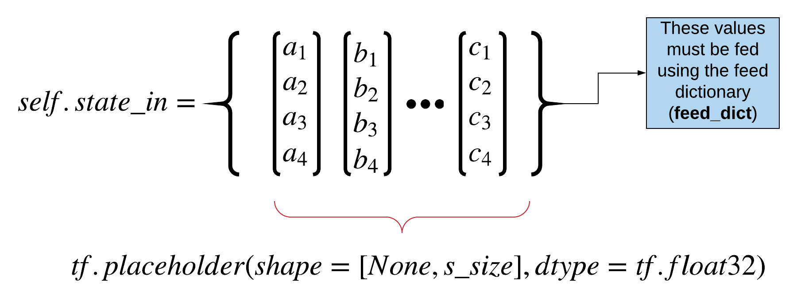

    hidden = slim.fully_connected(self.state_in,h_size,biases_initializer=None,activation_fn=tf.nn.relu)
    
### This line creates the hidden layer of the neural network that is used to calculate the policy given the state


### The variable ***hidden*** is the hidden layer from the neural network represented in the figure below

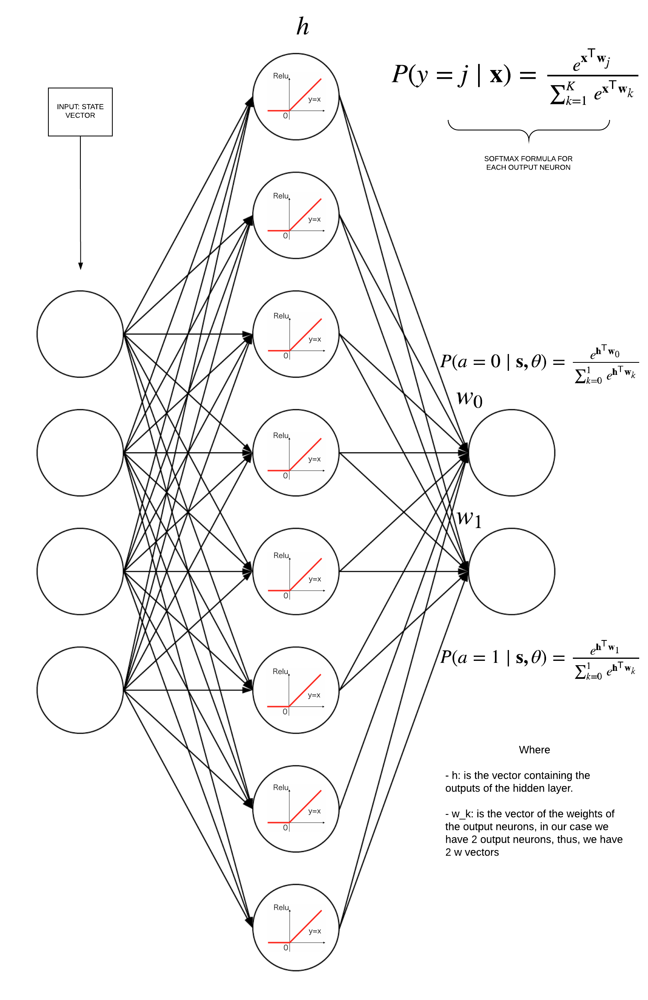

    self.output = slim.fully_connected(hidden,a_size,activation_fn=tf.nn.softmax,biases_initializer=None)
    
### The variable ***self.output*** is the output layer of the neural network. It would be a vector of dimension 2. But because we have None as one of the input dimensions we also have None as one of the output dimensions, thus the output dimension is [None,2] for our case.
     
    self.chosen_action = tf.argmax(self.output,1)

### We have 2 actions in the cart pole example; left, and right, represented by 0 and 1 respectively. This line tells us whether 0 or 1 was selected given the input state and our policy function, represented by the neural network. Explicitly what this line does is the following:

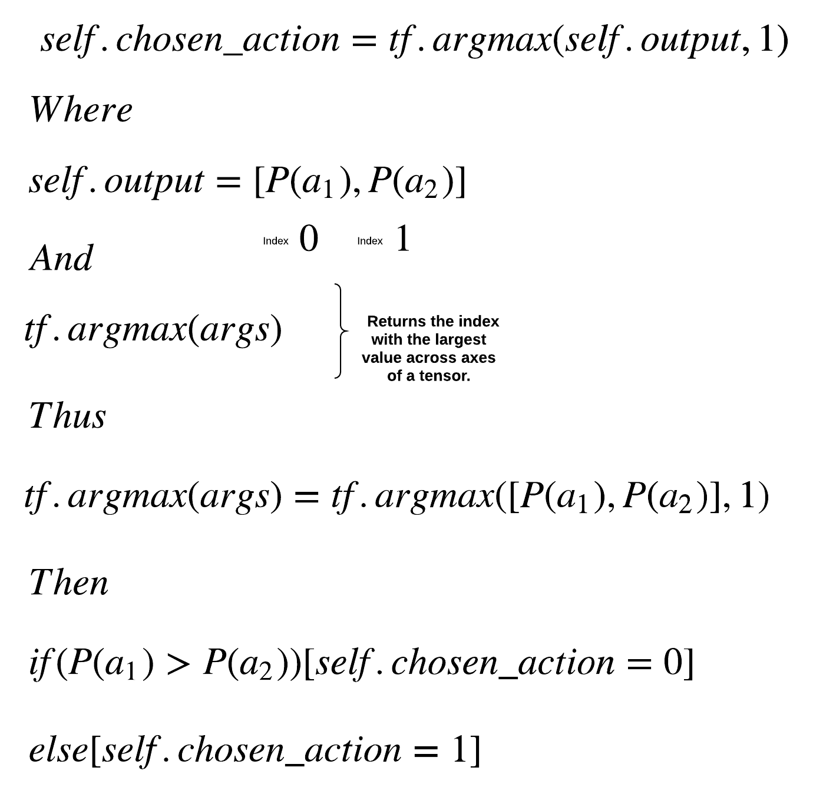

### This variable (***self.chosen_action***) is not used during the training process, because we need to explore, thus we need to sample from the action probability distribution. This variable can be used in order to test the model after having trained it.

        self.reward_holder = tf.placeholder(shape=[None],dtype=tf.float32)
        self.action_holder = tf.placeholder(shape=[None],dtype=tf.int32)
        
### These two lines will save the rewards and actions. They are represented by a one dimensional array of undefined size:


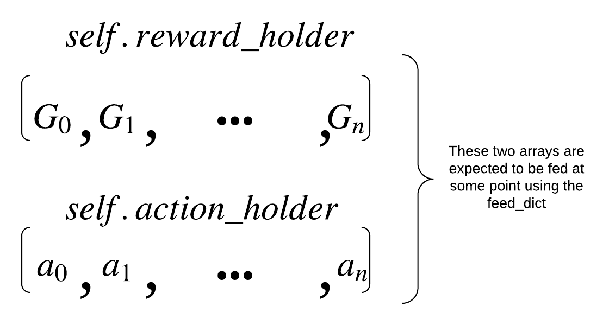


    self.indexes = tf.range(0, tf.shape(self.output)[0]) * tf.shape(self.output)[1] + self.action_holder

### This line what it does is to give the indexes of the responsible outputs, it tells us which of the two output neurons is responsible for the action executed by given us its index.

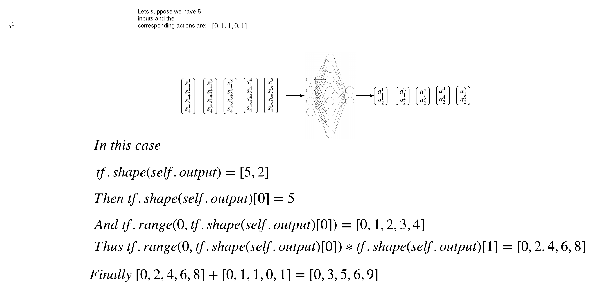


    self.responsible_outputs = tf.gather(tf.reshape(self.output, [-1]), self.indexes)

### This line selects the corresponding outputs given the indexes calculated above

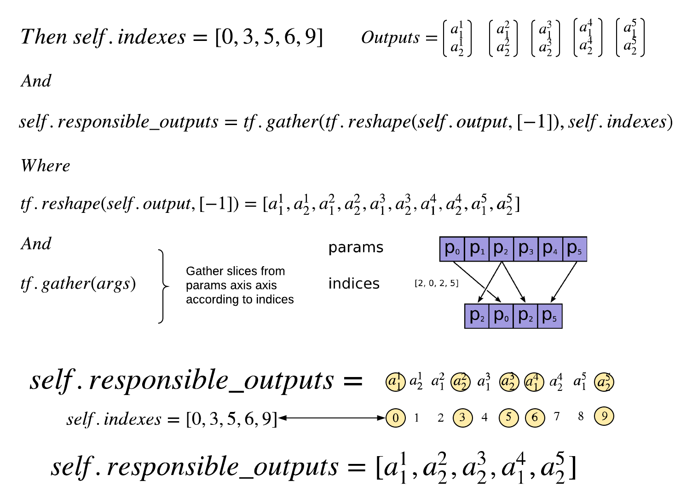
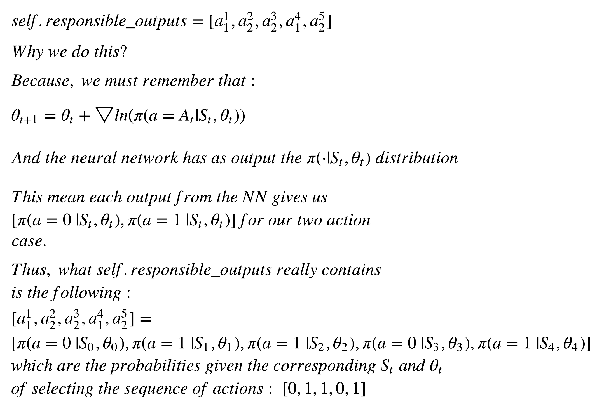
     
     
    self.loss = -tf.reduce_mean(tf.log(self.responsible_outputs)*self.reward_holder)
    
### This line calculates the following:

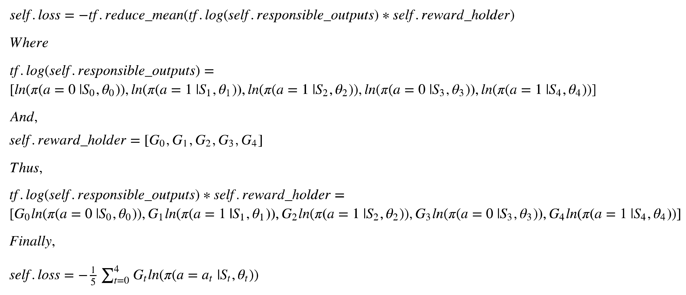

    tvars = tf.trainable_variables()
    
### tvars is a list of all the trainable variables. We explain what we mean with that below:   

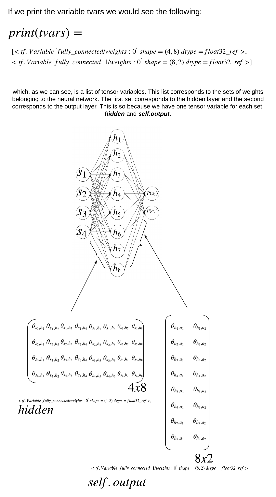
     
        self.gradient_holders = []
        for idx,var in enumerate(tvars):
            placeholder = tf.placeholder(tf.float32,name=str(idx)+'_holder')
            self.gradient_holders.append(placeholder)
            
### The goal of these 4 lines is to create a list of placeholders of undefined shape whose name will be ***i_holder***, where ***i*** is the index of the elements inside the list tvar. Thus, for each element of ***tvar*** we will have a placeholder element inside the variable ***self.gradient_holders***.      

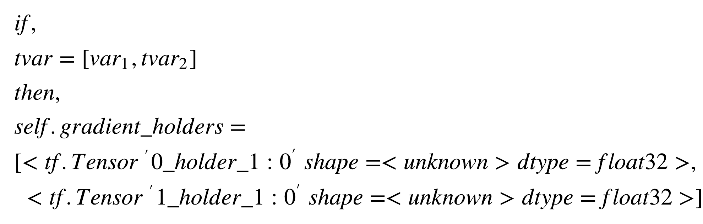

    self.gradients = tf.gradients(self.loss,tvars)
    
### This line calculates the gradient of self.loss with respect to tvars. This process can be seen in the figure below:  


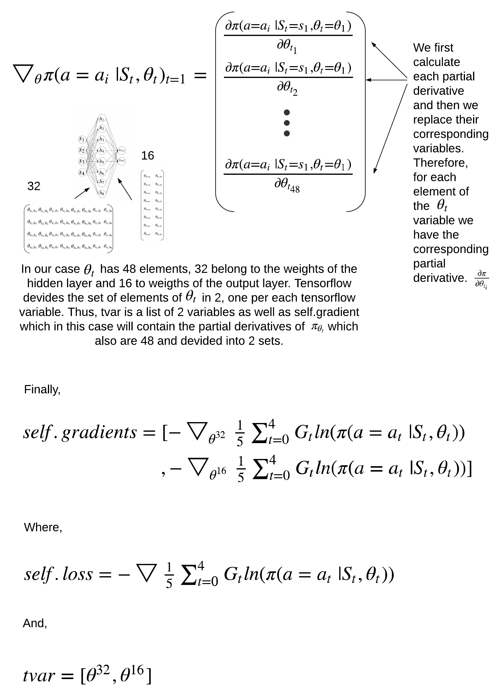     
     
    optimizer = tf.train.AdamOptimizer(learning_rate=lr)
    
### This line constructs a new Adam optimizer with learning rate ***lr*** 


    self.update_batch = optimizer.apply_gradients(zip(self.gradient_holders,tvars))
    
### This line updates the neural network weights following the Adam optimization algorithm and the corresponding gradients. We can see the process executed by this command in the figure below:  

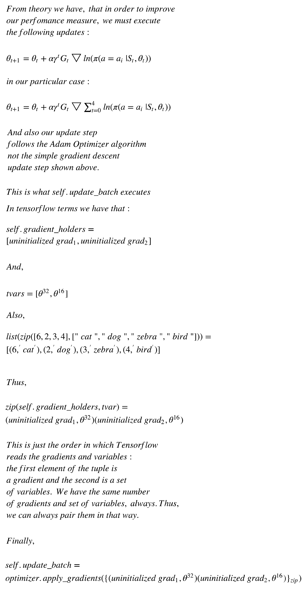  


# With this, we end the line by line explanation of the Agent class.


# Training
```python 
tf.reset_default_graph() #Clear the Tensorflow graph.

myAgent = agent(lr=1e-2,s_size=4,a_size=2,h_size=8) #Load the agent.

total_episodes = 5000 #Set total number of episodes to train agent on.
max_ep = 999
update_frequency = 5

init = tf.global_variables_initializer()

# Launch the tensorflow graph
   
with tf.Session() as sess:
    sess.run(init)
    i = 0
    total_reward = []
    total_lenght = []
        
    gradBuffer = sess.run(tf.trainable_variables())
    for ix,grad in enumerate(gradBuffer):
        gradBuffer[ix] = grad * 0
        
    while i < total_episodes:
        s = env.reset()
        running_reward = 0
        ep_history = []
        for j in range(max_ep):
            #Probabilistically pick an action given our network outputs.
            a_dist = sess.run(myAgent.output,feed_dict={myAgent.state_in:[s]})
            a = np.random.choice(a_dist[0],p=a_dist[0])
            a = np.argmax(a_dist == a)

            s1,r,d,_ = env.step(a) #Get our reward for taking an action given a bandit.
            ep_history.append([s,a,r,s1])
            s = s1
            running_reward += r
            if d == True:
                #Update the network.
                ep_history = np.array(ep_history)
                ep_history[:,2] = discount_rewards(ep_history[:,2])
                feed_dict={myAgent.reward_holder:ep_history[:,2],
                        myAgent.action_holder:ep_history[:,1],myAgent.state_in:np.vstack(ep_history[:,0])}
                grads = sess.run(myAgent.gradients, feed_dict=feed_dict)
                for idx,grad in enumerate(grads):
                    gradBuffer[idx] += grad

                if i % update_frequency == 0 and i != 0:
                    feed_dict= dictionary = dict(zip(myAgent.gradient_holders, gradBuffer))
                    _ = sess.run(myAgent.update_batch, feed_dict=feed_dict)
                    for ix,grad in enumerate(gradBuffer):
                        gradBuffer[ix] = grad * 0
                
                total_reward.append(running_reward)
                total_lenght.append(j)
                break

        
            #Update our running tally of scores.
        if i % 100 == 0:
            print(np.mean(total_reward[-100:]))
        i += 1
```
    tf.reset_default_graph()

### This line clears the default Tensorflow graph

    myAgent = agent(lr=1e-2,s_size=4,a_size=2,h_size=8)
### This line instantiates an object of the agent class. The agent class receives the following parameters when instantiated:

 - ***lr***: Is the learning rate.
 - ***s_size***: Is the size of the state vector.
 - ***s_size***: Is the size of the action vector.
 - ***h_size***: Is the amount of neuron from the hidden layer.
```python
    total_episodes = 5000 #Set total number of episodes to train agent on.
    max_ep = 999
    update_frequency = 5
```    
### These variables are training variables. 

- total_episodes: The maximum amount of episodes that we consider in the training.
- max_ep: The maximum number of steps for each episode.
- update_frequency: We update each every *update_frequency* number of episodes.
 
```python     
     init = tf.global_variables_initializer()
```  
### This variable is the Tensorflow global variable initializer. Its purpose is to initialize the Tensorflow variables.
   
    with tf.Session() as sess:

### This line opens the Tensorflow session. Everything in its scope will be on the session.

    sess.run(init)
    
### We execute the variable initializer    

    i = 0
    total_reward = []
    total_lenght = []

- **i**: The episode counter
- **total_reward**: saves the total reward
- **total_length**: saves the numbers of steps

```python  
    gradBuffer = sess.run(tf.trainable_variables())
```  
We have seen this command before. It is the same as tvar. Returns all variables created with trainable=True. In our case the neural network weigths. 

    for ix,grad in enumerate(gradBuffer):
        gradBuffer[ix] = grad * 0
        
### These 2 lines set the variable values to 0.  

    while i < total_episodes:

### This is the main loop, it states that the training will run a total of total_episodes times.

    s = env.reset()

### This line of code saves the initial state of the cart-pole environment into the variable s.

    running_reward = 0
  
### This variable keeps track of the total reward amount given in the current episode.  
        
    ep_history = []
    
### This variable will keep track of all the rewards, states, and actions of the current episode.  

    for j in range(max_ep):
    
### This is the loop for the steps. By default it will iterate until ***max_ep***  

    a_dist = sess.run(myAgent.output,feed_dict={myAgent.state_in:[s]})
    a = np.random.choice(a_dist[0],p=a_dist[0])
    a = np.argmax(a_dist == a)
    
### The purpose of these 3 lines is to select an action randomly, given the current state, following the pi(a,|s,theta) distribution. The explanation of how this is done can be found below: 

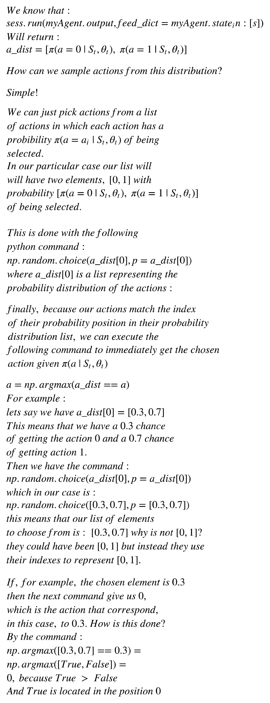

    s1,r,d,_ = env.step(a)

### We execute an action, and the environment gives us back the new state, the reward, and whether is the last step or not.

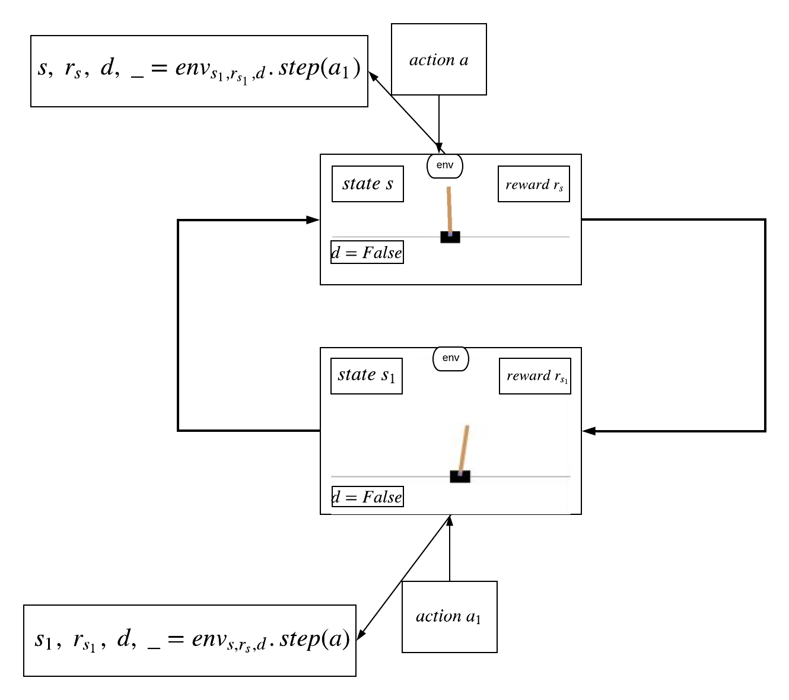

    ep_history.append([s,a,r,s1])

### This line will register states, actions, reward, and subsequent state of each step.

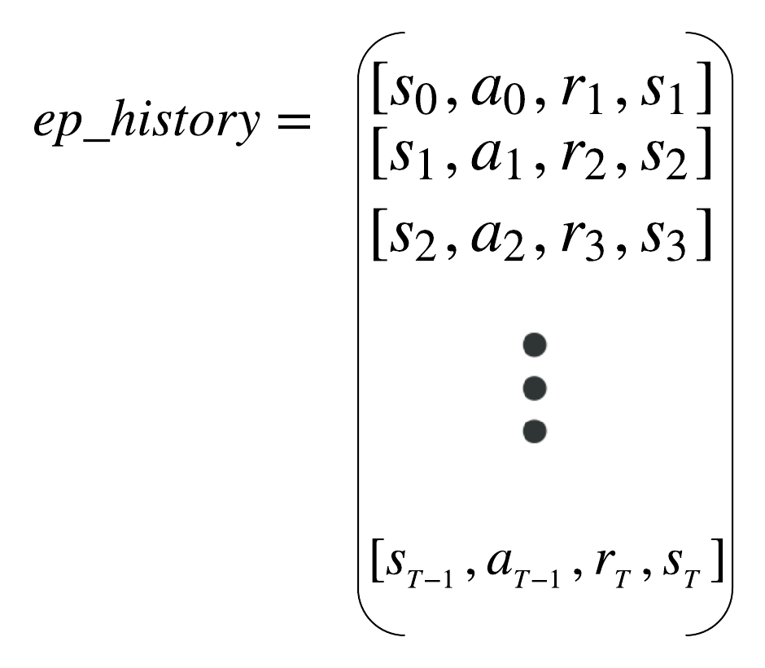

    s = s1
    running_reward += r
            
### The first line updates the state. It makes the new state to be the current state. The second line registers the total reward earned until the current step.    

    if d == True:
    
### Condition to check if we have reached the end of the episode, If it is true, then the code below executes.    
     
# FINAL STEP!!!
# UPDATING THE NETWORK

## Final code section, we update the weights of the neural network that represents the policy function.     

    ep_history = np.array(ep_history)
    
### We transform the list of step information elements (list of lists) into a numpy array. We do this in order to slice it easily.   

    ep_history[:,2] = discount_rewards(ep_history[:,2])
    
### This command creates the returns for each step in the current episode.  

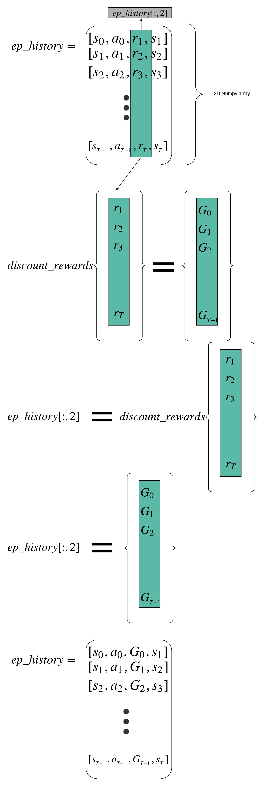

    feed_dict={myAgent.reward_holder:ep_history[:,2],
                        myAgent.action_holder:ep_history[:,1],myAgent.state_in:np.vstack(ep_history[:,0])}
                        
### This line feeds the placeholder variables belonging to the graph that is contained in the agent object.
### Three are the placeholder variables being fed:

 - **myAgent.reward_holder**: This placeholder variable contains the returns (calculated before) of each step
 - **myAgent.action_holder**: This placeholder variable contains the actions of each step
 - **myAgent.state_in**: This placeholder variable contains the states of each step
 
       grads = sess.run(myAgent.gradients, feed_dict=feed_dict)
    
### This line executes the Tensorflow variable __*myAgent.gradients*__ which requires three placeholders to be fed. These placeholders are fed by passing the *feed_dict* dictionary to the *feed_dict* parameter. The *feed_dict* dictionary was built above.  

### We can see the flow of execution below:

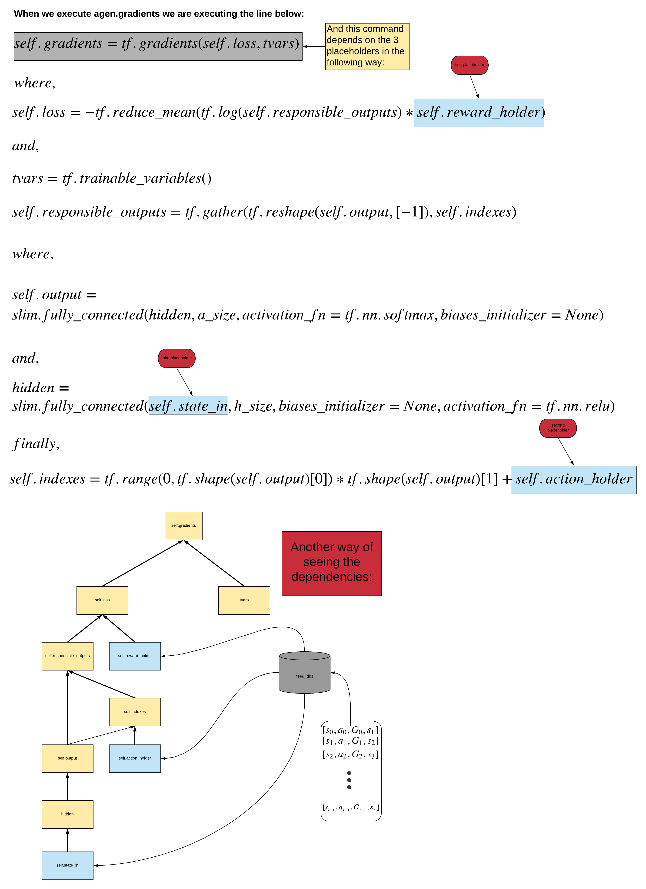

# Looking at the code we can realize that this algorithm does a batch training. The batch training set size has, at least, the same size as the number of steps of each episode. If we set the variable update_frequency to more than one, then, the batch training waits update_frequency episodes, before updating the weights. The gradBuffer variable accumulates the gradient information from the past episodes.

    for idx,grad in enumerate(grads):
        gradBuffer[idx] += grad
        
### gradBuffer accumulates the gradients until it has passed update_frequency amount of episodes since the last update.   

    if i % update_frequency == 0 and i != 0:
    
### If update_frequency amount of episode has passed since the last update, then we execute the code below.   

    feed_dict= dictionary = dict(zip(myAgent.gradient_holders, gradBuffer))
                    _ = sess.run(myAgent.update_batch, feed_dict=feed_dict)
                    
### These two lines feed the placeholders required for the execution of the *myAgent.update_batch* variable. We explain the whole process below:  

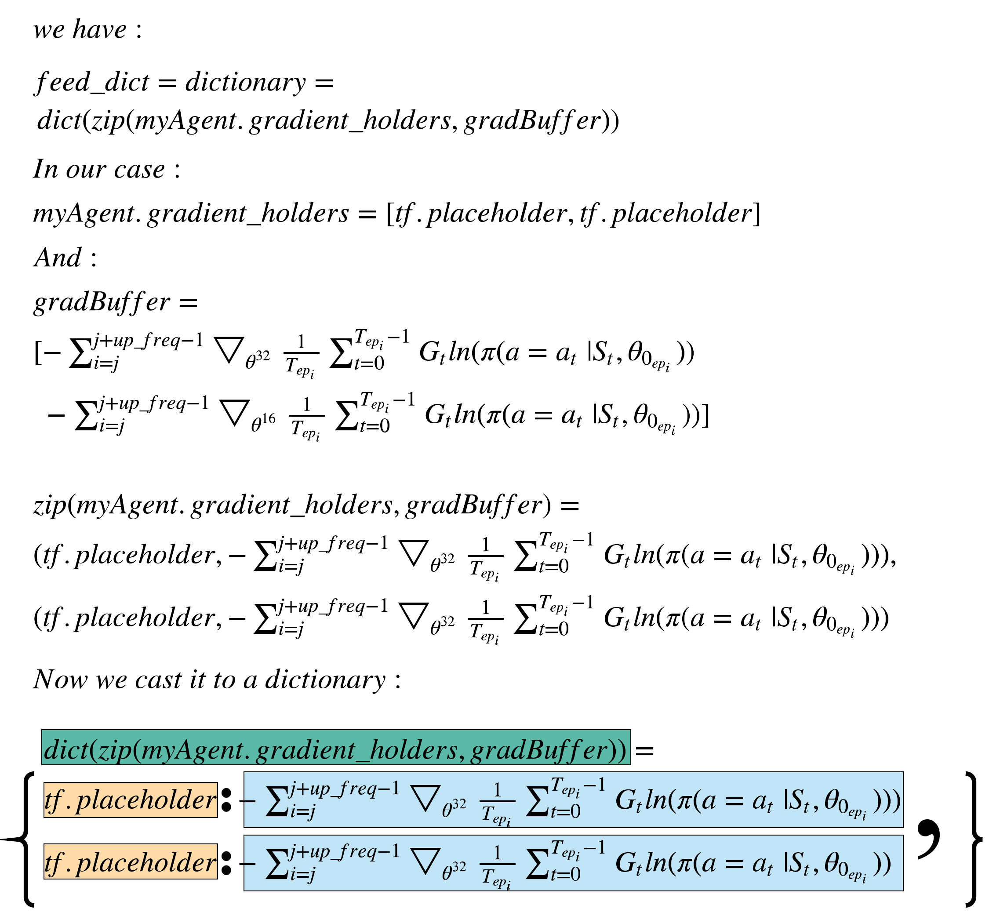

    _ = sess.run(myAgent.update_batch, feed_dict=feed_dict)
    
### This line executes the Tensorflow variable myAgent.update_batch, given the dictionary descrived above.  

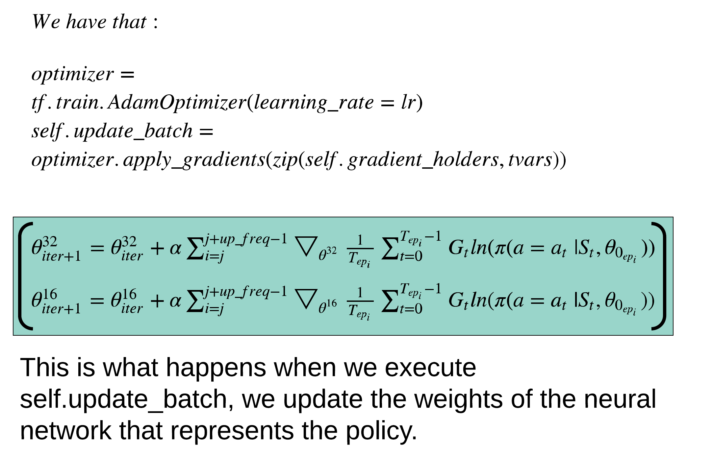

    for ix,grad in enumerate(gradBuffer):
        gradBuffer[ix] = grad * 0
        
### Once we update the weights, we reset the gradBuffer variable to 0.     

    total_reward.append(running_reward)
    total_lenght.append(j)
    
### The first line saves the total reward of the current episode in a list of total rewards per episode. The second line saves the number of steps of the current episode in a list of total number of states per episode.    

     if i % 100 == 0:
         print(np.mean(total_reward[-100:]))
      i += 1
      
### The purpose of the first two lines is to print the average total reward of the last 100 episodes once every 100 episodes.

### The last line increment the episode counter.

# END
